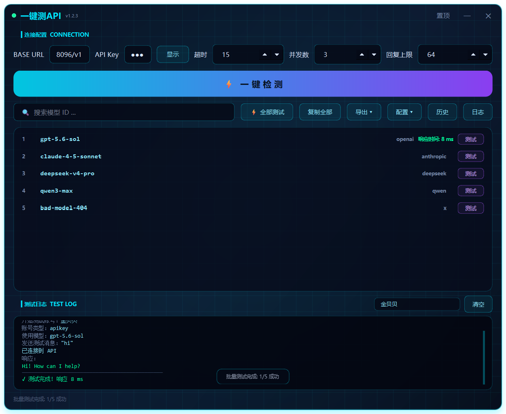

# 一键测API (OneClick Model Test)

一个**科技风深色 GUI 工具**，用于一键检测任意 **OpenAI 兼容接口**的可用模型列表，并逐个/批量测试模型的响应延迟。

> 版本 **v1.2.3** · Python 3.13 + PySide6 · Windows



---

## 下载

**免安装，双击即用**（无需 Python 环境）：

👉 [**OneClickModelTest-v1.2.2-windows-x64.exe**](https://github.com/383827453-max/OneClickModelTest/releases/latest)

| 项 | 值 |
|---|---|
| 大小 | 57,993,831 字节（约 55.3 MB） |
| SHA256 | `e5ceacb44c4d2acafb5d12c6ab1758d029938a3a818d72dddf84767b5a51f9af` |
| 平台 | Windows x64 |

```powershell
# 下载后校验完整性
Get-FileHash .\OneClickModelTest-v1.2.2-windows-x64.exe -Algorithm SHA256
```

> 资产名为英文是因为 GitHub Release 不支持非 ASCII 文件名；
> 程序运行后窗口标题、注册表键名仍为「一键测API」。
>
> 历史版本见 [Releases](https://github.com/383827453-max/OneClickModelTest/releases)。

---

## 功能

| 功能 | 说明 |
|------|------|
| 🔍 一键检测 | `GET {BASE URL}/models` 拉取全部可用模型 |
| ⚡ 单模型测试 | `POST {BASE URL}/chat/completions` 测真实响应时间（ms） |
| ⚡ 全部测试 | 按设定的**并发数**批量测，最大并发可调 |
| 📜 实时日志 | 窗口下方日志面板逐步显示：账号 → 模型 → 发送消息 → 已连接 → **响应正文** → 耗时 |
| 🎚️ 回复上限 | 测试请求 `max_tokens` 可调（1–8192，默认 64），能看出模型是否真的完整回话 |
| 📦 配置导入导出 | 工具栏「配置 ▾」一键导出/导入 JSON，或复制/粘贴到剪贴板，便于备份与换机 |
| 🔎 搜索过滤 | 按模型 ID 实时过滤列表 |
| 📋 复制 | 单条复制 / 一键复制全部模型 ID |
| 💾 导出 | CSV（表格）/ JSON（完整数据）/ TXT（纯模型 ID） |
| 🕘 历史记录 | 每次检测自动落库，支持单条删除与一键清空 |
| 📌 窗口置顶 | 可切换置顶，无边框自绘标题栏 |
| ⌨️ 快捷键 | `F5` 快速检测 |

## 界面特性

- 无边框窗口 + 自绘圆角霓虹描边（青色 `#00e5ff` × 紫色 `#a855f7`）
- 深色渐变底 + 网格纹理 + 径向辉光
- 自定义状态指示灯（就绪 / 检测中 / 成功 / 失败，带呼吸动画）
- 主按钮悬停高度动画，卡片式模型行
- 模型列表 / 日志面板用垂直 `QSplitter` 分隔，高度可拖拽，工具栏「日志」按钮可整体收起
- 全局 QSS 主题，含 hover / pressed / disabled 全态

## 安装

```bash
pip install -r requirements.txt
```

## 运行

```bash
python main.py
```

## 打包

```bash
pip install pyinstaller
pyinstaller build.spec --noconfirm
# 产物: dist/一键测模型.exe
```

## 使用

1. 填入 **BASE URL**（例如 `http://localhost:8082/v1`，或任意中转站地址）
2. 填入 **API Key**（检测模型列表可留空，**测试模型响应时间必须填写**）
3. 点「⚡ 一键检测」拉取模型列表
4. 点单行「测试」按钮，或「⚡ 全部测试」批量跑延迟
5. 看下方**日志面板**：会显示「开始测试账号 / 使用模型 / 发送测试消息 /
   已连接 / 响应正文 / 耗时」，用来确认模型是**真的回了话**还是只返回了空壳
6. 「导出 ▾」保存结果

> 日志面板顶部可填**账号别名**（留空则显示 BASE URL 主机名）；
> 「回复上限」控制测试请求的 `max_tokens`，设太小可能只拿到截断回复。

## 测试

```bash
# 离屏冒烟测试（21 项断言，不联网、不写注册表）
QT_QPA_PLATFORM=offscreen python tests/smoke_v122.py
```

Windows PowerShell：

```powershell
$env:QT_QPA_PLATFORM="offscreen"; python tests/smoke_v122.py
```

## 接口约定

只依赖两个标准 OpenAI 兼容端点：

```
GET  {BASE URL}/models              -> {"data": [{"id": "...", "owned_by": "..."}]}
POST {BASE URL}/chat/completions    -> {"choices": [...]}
```

测试请求体：

```json
{
  "model": "<model id>",
  "messages": [{"role": "user", "content": "hi"}],
  "max_tokens": 64,
  "stream": false
}
```

`max_tokens` 取自界面「回复上限」，默认 64。响应正文按
`choices[0].message.content` → `choices[0].text` → 扁平 `content` /
`response` / `output_text` / `message` 的顺序提取，都不命中则回落原始响应体。

## 错误处理

工具对以下情况给出明确中文提示，而不是静默失败：

- `ConnectTimeout` → 连接超时
- `ReadTimeout` → 读取超时
- `ConnectionError` → 连接失败
- `RequestException` → 请求异常
- 非 200 → 附带 HTTP 状态码与响应体片段
- 非法 JSON → 解析失败
- 缺少 `data` 字段 → 格式异常
- `401/403` → API Key 无效或无权限
- `404` → 模型不存在或未部署
- `429` → 额度不足或触发限流

## 配置存储

配置与历史记录通过 **`QSettings`** 存入 **Windows 注册表**（`HKCU\Software\YiJianCeAPI\一键测API`），不产生外部文件。

若检测到旧版 `config.json` / `history.json` 位于程序目录，会自动迁移进注册表并删除原文件。

## 配置导入 / 导出

工具栏 **「配置 ▾」** 提供四个操作，全部一键完成：

| 菜单项 | 作用 |
|---|---|
| 导出配置为 JSON 文件 | 把当前全部设置写入 JSON（默认名 `一键测API-配置-YYYYMMDD.json`） |
| 从 JSON 文件导入配置 | 选文件后立即应用并持久化 |
| 复制配置到剪贴板 | 直接把 JSON 放进剪贴板 |
| 从剪贴板粘贴配置 | 从剪贴板读取并应用 |
| 恢复默认配置 | 一键回到出厂设置 |

导出的 JSON 带自描述头，方便识别和分享：

```json
{
  "app": "一键测API",
  "kind": "config",
  "version": "1.2.3",
  "exported_at": "2026-09-18 00:30:00",
  "note": "此文件包含 API Key，请妥善保管",
  "config": {
    "base_url": "http://localhost:8082/v1",
    "api_key": "sk-...",
    "timeout": 15,
    "test_concurrency": 3,
    "max_tokens": 64,
    "account_alias": "",
    "always_on_top": false,
    "show_log": true
  }
}
```

> ⚠️ 导出的文件**包含明文 API Key**，请勿提交到公开仓库或发送给他人。

**导入是容错的**，不会因为一个字段写错就整体失败：

- 兼容 `{config:{...}}` 包装形式和**裸配置**（顶层直接是字段）
- 类型不符的字段丢弃（如 `timeout: "abc"`、`base_url: 123`）
- 未知键忽略，不影响其余字段导入
- 数字型字段接受数字字符串（`"77"` → `77`）
- 布尔字段接受 `"true"` / `"1"` / `"yes"` / `"on"`
- `base_url` 为空 → **整体拒绝**，不覆盖当前配置
- 无任何有效字段 → 拒绝并提示

## 项目结构

```
.
├── main.py                    # 全部源码（单文件，1646 行）
├── requirements.txt
├── build.spec                 # PyInstaller 打包配置
├── README.md
├── CHANGELOG.md               # 版本变更记录
├── LICENSE
├── tests/
│   ├── smoke_v122.py          # 日志面板冒烟测试（22 项断言）
│   └── smoke_config_io.py     # 配置导入导出测试（52 项断言）
├── .github/
│   ├── workflows/build.yml    # CI：遍历跑 smoke_*.py + 构建 Windows exe
│   └── ISSUE_TEMPLATE/        # Bug 报告 / 功能建议表单
├── docs/
│   └── screenshot.png         # 界面预览图
└── docs_bytecode_disasm.txt   # 字节码反汇编存档（用于核对逻辑）
```

## 测试

```bash
# 全部冒烟测试（不联网、不写注册表）
python tests/smoke_v122.py
python tests/smoke_config_io.py
```

CI 会自动遍历 `tests/smoke_*.py`，新增测试文件无需改 workflow。

## 源码结构

```
main.py
├── 常量层        APP_NAME / APP_VERSION / 主题色 / MAX_CONCURRENT_TESTS
├── 存储层        app_dir / _st / load_config / save_config_data
│                 load_history / save_history / _migrate_legacy_files
├── 数据层        family_of / normalize_models
├── 渲染          make_app_pixmap / GLOBAL_QSS
├── 线程          ApiWorker         → GET /models
│                 ModelTestWorker   → POST /chat/completions
│                                     （progress 信号上报 发送/已连接/响应）
├── UI 组件       StatusDot / DetectButton / ModelRow
│                 LogPanel（实时测试日志）/ RootWidget / WindowFrame / TitleBar
│                 HistoryRow / HistoryDialog
└── 主窗口        MainWindow（检测、批量测试队列、导出、历史、日志、toast）
                  配置导入导出：export_config_json / import_config_json /
                  copy_config_json / paste_config_json / reset_config /
                  _parse_config_payload / _apply_cfg_to_ui
```

## License

MIT
